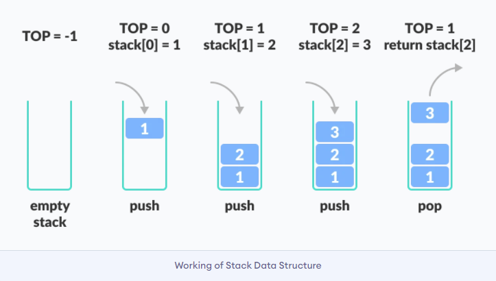

# Table of Contents
- [Introduction](#introduction)
- [Purpose of Stack Data Structures](#purpose-of-stack-data-structures)
- [Basic Operations of Stack Data Structures](#basic-operations-of-stack-data-structures)
- [Efficiency and Performance of Stack Data Structure](#efficiency-an-pPerformance-of-stack-data-structure)
- [Example Problem using Stack in Python](#example-problem-using-stack-in-python)
- [Exercises](#exercises)


# Introduction

 In programming, a Stack is a data structure that operates on the principle of Last In First Out (LIFO). When an element is added, it is placed at the top of the stack. Stack allows all data to be accessed from a single point. As a result, the element at the top of the stack is the only one that can be removed, and only one item can be read or removed at a time.

 As a visual aid, we can think of a stack of books like the image below.
 
 Photo Credit: *drawinghowtos.com*

 From the picture above, the blue book is, of course, the most recent addition to the stack. To get to the green book, you must first remove the blue and yellow books, and then the green book, and this is how the stack data structure works.

# Purpose of Stack Data Structures

Stack data structure serve many purposes. They are widely used in software developement. An examples is a browser. A browser's back button saves all of the URLs you've viewed previously in a stack. A new page is added to the top of the stack each time you visit it. The current URL gets removed from the stack and the previous URL is accessed when you use the back button.

# Basic Operations of Stack Data Structures

The following are basic operations that allow us to perform different actions on a stack
- **push(value):** Addig elements to the top of the stack.
- **pop():** Removing elements from the top of the stack.
- **is_empty():** This returns true if the stack is empty.
- **size():** This returns the size of the stack.
- **peek():** This gets the top element of the stack, without removing the element.

Here is a picture showing some of these operations

Photo Credit: *programiz.com*


# Efficiency and Performance of Stack Data Structure

The worst-case run-time complexity for all basic stack operations (push(), pop(), is_empty(), size()) can be O(1). Because they only work with one end of the data structure — the top of the stack — push and pop are likewise O(1).

# Example Problem using Stack in Python

Python list can be used to implement stack data structure. We will be using python's append and pop methods of list to achieve push() and pop() operations of stack data structure.

```python
def reverser_string(word):
    """This function takes in a string
       and prints out the reverse using
       push() and pop() operation of stack.

    Args:
        word (_type_): string
    """
    # An empty stack to store characters
    # from "word" parameter.
    stack = []

    # A for loop to populate the empty
    # stack with characters from "word".
    for char in word:
        stack.append(char)

    # A for loop to print out these 
    # characters from the stack
    # using pop() operation.
    for i in range(len(word)):
        print(stack.pop(), end='')

# Test Case
word = "love"
reverser_string(word)

# Output
>: evol
```
[Here is the link to the code snippet above](reverse_string.py)

Also, if you will like to see the full implementation of the various stack operations, you can inspect this code: [Full implementation of stack operation](reverse_string_fullflesh.py)

**Credit:** The full implementation of stack operation code above was gotten from Geeksforgeeks.com

# Exercises
Here is an industry standard exercise that can help you with software engineering interview questions

**Question**

Given an expression string exp, write a program to examine whether the pairs and the orders of “{“, “}”, “(“, “)”, “[“, “]” are correct in exp.

**Example**

```python
Input: exp = “[()]{}{[()()]()}”
Output: Balanced 

Input: exp = “[(])” 
Output: Not Balanced 
```

Try completing this code: [Exercise](exercise.py) before looking at the solution here: [Exercise Solution](exercise_solution.py)

**Credit:** The exercise and exercise solution above was gotten from Geeksforgeeks.com
***
[Back to top](#table-of-contents)