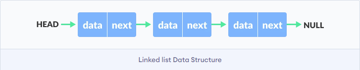
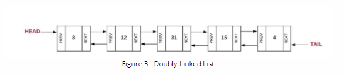
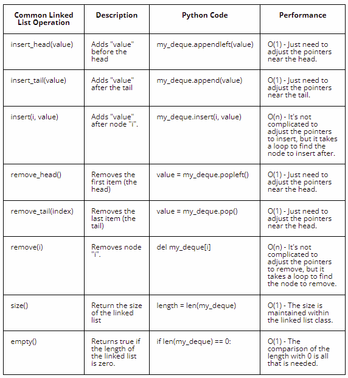

# Table of Contents
- [Introduction](#introduction)
- [Linked List Operations in Python](#linked-list-operations-in-python)
- [Application of Linked List](#application-of-linked-list)
- [Example Problems using Linked List in Python](#example-problems-using-linked-list-in-python)
- [Example Problem using Linked List in Python](#example-problem-using-linked-list-in-python)

# Introduction
Link list is another important data structure used in programming to store data when these data are not required to be next to each other unlike arrays. Link list is also a linear data structure. It consist of series of nodes that are connected together by reference. With some example as we will see below, the word node will be explained better.

I like to see nodes as an array of two elements. In other words, a node is an array containing a value and the address of another node or a pointer to another node. Depending on the type of linked list, theis node (array of elements) can contain only two elements or three elements.

Here is a picture showing an example



Photo Credit: programiz.com

One important thing to note is that with linked list data structure, there is not guarantee that one node will be next to another node in memory. Just as we had seen in the picture, in linked list, the first node is called the head and the node whose next value if NULL is the last node and it is called a tail node.

Here is picture from CSE212 course material



Photo credit: byui_cse212 course material.

I love the explanation given in the byui_cse212 course material. Here is a paragraph from the course content

"In the linked list shown above, the first node is called the HEAD. If you know where the head is, then you can traverse the entire linked list by following the pointers. Most linked lists maintain a bi-deirectional linking between nodes. Bi-directional means that each node will maintain a pointer to both the next and previous node. The doubly-linked list shown below has both a head and a tail."

# Linked List Operations in Python
Just like other data structures, linked list has a number of operations you can perform on them. I have provided a picture from the same byui_cse212 course material explaining these operations with some python example implementation.


Photo Credit: byui_cse212 course material.

# Application of Linked List
There are many applications of linked list data structures, here are some list:
- Dynamic memory allocation
- Undo functionality of softwares
- Multiplayer games
- Hash tables
# Example Problems using Linked List in Python
A Node Class will be create this way in Python
```Python
class Node:
    def __init__(self, value):
        self.value = value
        self.next = None
        self.prev = None
```
A LinkeList Class will be created this way in Python
```Python
class LinkedList:
    def __init__(self):
        self.head = None
        self.tail = None
```
Click [here](linked_list_impl.py) to see am example of the implementation of a linked list and some linked list operations.
# Example Problem using Linked List in Python
Question:
```python
Given the head of a singly linked list, reverse the list, and return the reversed list.

Input: head = [1, 2, 3, 4, 5]
Output: [5, 4, 3, 2, 1]
```
Implement your answer [here](linked_list_exercise.py). You can find the solution [here](linked_list_solution.py)

[Back to top](#introduction)
