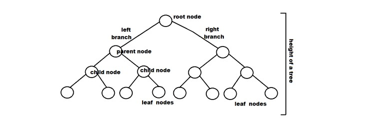
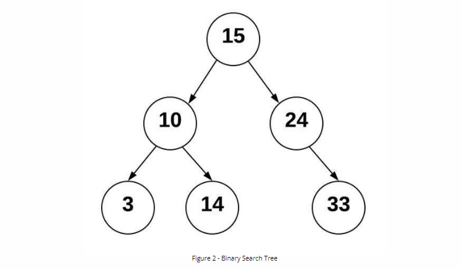
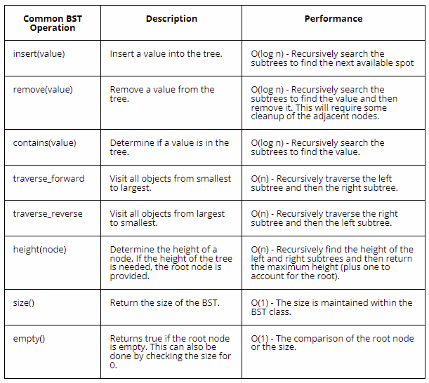

# Table of Contents
- [Introduction](#introduction)
- [Tree Terminologies](#tree-terminologies)
- [Types of Tree Data Structure](#types-of-tree-data-structure)
- [Tree Traversal](#tree-traversal)
- [Binary Search Tree](#binary-search-tree)
- [Example Problem using Tree Data Structures in Python](#example-problem-using-tree-data-structures-in-python)
- [Exercises](#exercises)

# Introduction
A tree is a non-linear data structure consisting of a collection of nodes connected by directed or undirected edges. A tree data structure can be empty(containing no node), it can contain a single node called the root node or it can contain a root and other sub nodes or subtrees.
# Tree Terminologies
In this subsection, we will be learning about some basic terminologies that are common when working with tree data structures.
- **Node:** A node is an element of a tree. It contains a value and pointer to its child nodes.

- **Leaf:** If a node does not contain a pointer to a child node, then that node can be referred to as a leaf node, in other words, any node that does not have a child is called a leaf node. The pointers of leaf nodes usually points to None or Null.

- **Root:** The topmost node of a tree is the root node. The root node can also be seen at the element of a tree data structure that determines which sides of the tree a node goes, depending on the content or data or value of such node.

- **Edge:** In tree data structure, edge is the link between two nodes.

- **Child Node:** If a node is a lead to another node, then that node is a child to the node to which it is a leaf.

- **Parent Node:** As you might be thinking, a node that has leaf is parent to that leaf. That means the parent node has an edge to a child node.

- **Height of a Tree:** The height of a tree is the number of nodes from the root node to the deepest leaf.

- **Height of a Node:** The height of a node is the number of edges from that node to the deepest leaf.

- **Dept of a Node:** The dept of a node is the number of edges from the root nood to that node.

Here is a picture illustrating some of these terminologies

Photo Credit: upgrad.com

# Types of Tree Data Structure
Here are some common types of tree data structures
- **General Tree**
- **Binary Tree**
- **Binary Search Tree**
- **AVL Tree**
- **Red Black**
- **B-Tree**
# Tree Traversal
Traversing a tree entails visiting all of its nodes. There is just one way to read data in linear data structures like arrays, stacks, queues, and linked lists. A tree, on the other hand, is a hierarchical data structure that may be traversed in a variety of ways. These ways includes:
- **Inorder traversal:** 
    - Visit all nodes in the left subtree
    - Then visit the root node
    - Lastly, visit the all nodes in the right subtree
- **Preorder traversal:**
    - Visit the root node
    - Visit all nodes in the left subtree
    - Visit all nodes in the right subtree 
- **Postorder traversal:**
    - Visit all nodes in the left subtree
    - Visit all nodes in the right subtree
    - Visit the root node

# Binary Search Tree
According to cse212 course material, "A binary search tree (BST) is a binary tree that follows rules for data that is put into the tree. Data is placed into the BST by comparing the data with the value in the parent node. If the data being added is less than the parent node, then it is put in the left subtree. If the data being added is greater than the parent node, then it is put in the right subtree. If duplicates are allowed than the duplicate can be put either to the left or to the right of the root. By using this process, the data is stored in the tree sorted."

A picture representation of this explanaton

Photo Credit: cse212 course material

As we shall see in the example below, here is a pictoral representation of Binary Search Tree Operations.

Photo Credit: cse212 course material

# Example Problem using Tree Data Structures in Python

# Exercises

[Back to top](#table-of-contents)
